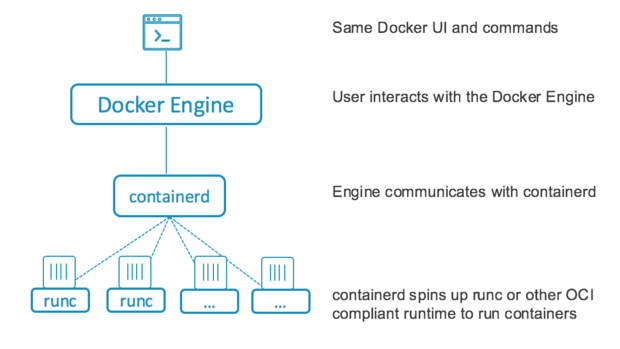

# Docker

> [!INFO] Docker
> Docker - це інструмент розробки та технологія віртуалізації, яка полегшує створення, розгортання та управління додатками за допомогою контейнерів. Контейнер - це окремий, легкий та виконуваний програмний пакет, що містить усі бібліотеки, конфігураційні файли, залежності та інші речі, необхідні для роботи додатка

## Архітектура Docker

У 2016 Докер вирішив розбити моноліт на окремі частини, деякі з яких можуть бути використані іншими проектами - так з'явився [`containerd`](https://blog.docker.com/2016/04/docker-containerd-integration/). Це був Docker 1.11.  
**Containerd** - це демон, який виконує роль фасаду API для різних контейнерних середовищ та ОС. Використовуючи `containerd`, ви більше не працюєте з системними викликами, натомість ви працюєте з високорівневими сутностями, такими як знімок і контейнер - решта абстрагується.  
Якщо ви хочете зрозуміти `containerd` ще глибше, є [документація по проектуванню](https://github.com/containerd/containerd/tree/master/design) в їх репозиторії на GitHub.  
Під капотом `containerd` використовує `runc` для виконання всієї роботи в Linux.

[StackOverflow](https://stackoverflow.com/a/34155329/9254063),  [Docker Engine Architecture Under the Hood](https://medium.com/@yeldos/docker-engine-architecture-under-the-hood-741512b340d5)
